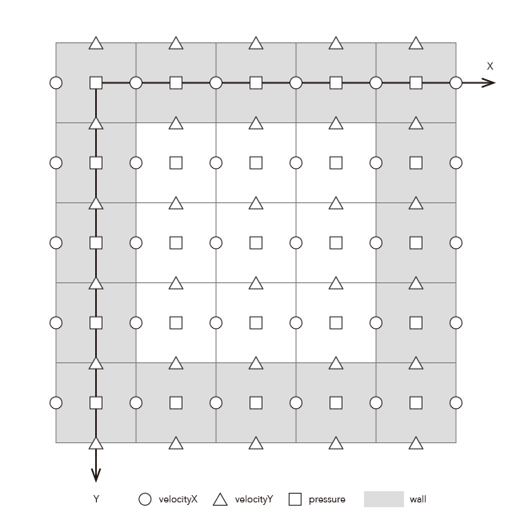

# fluid

## 00_simple
### simple0
- ナビエストークスの式(Navier Stokes equations)を解く
- 通常格子で計算する
- 外力項->移流項->粘性拡散項->圧力項の順で計算
- 外力項
  - マウスの移動によって速度を追加
- 移流項
  - semi-Lagrangian法によって、バックトレースした位置の速度を適用。バックトレースした場所の速度は線形補間によって求める
- 粘性拡散項
  - 陽解法(Explicit way)によって中間速度場を計算する
- 圧力項
  - 圧力項は計算不可が高い
  - ポアソンの方程式を解く
    - ∇2p = ρ/⊿t * div･v
    - 左辺は圧力分布の偏り、右辺は速度の発散
    - ラプラシアンはベクトル場の凹凸を表現している。
  - ガウス=ザイデル法
    - ガウス=ザイデル法は差分化したポアソンの方程式に対して、p(i,j) = ... の形に変形してから、全領域に対して反復する。
  - SOR法 Successive over-relaxation
    - SOR法はガウス=ザイデル法の収束を加速させるための係数を追加している。
    - 以下を反復する。
    - newX = (1 - ω) * prevX + ω * calcX
    - relaxation factor ω　は1のときガウス=ザイデル法と同じになる。大きいいほど収束スピードが早くなるが、発散しやすくなる。
- [CGのための物理シミュレーションの基礎](https://www.amazon.co.jp/dp/B00H78RP2Y/ref=dp-kindle-redirect?_encoding=UTF8&btkr=1)
- [流体力学のプログラムを作りたい！その１](http://blog.livedoor.jp/toropippi/archives/52986.html)
- [ガウス・ザイデル法を使った計算](http://www.yamamo10.jp/yamamoto/lecture/2006/5E/Linear_eauations/concrete_relax_html/node2.html#renritu_1)
- [SOR法](https://ja.wikipedia.org/wiki/SOR%E6%B3%95)

### simple1_staggered_grid
- staggered grid  

